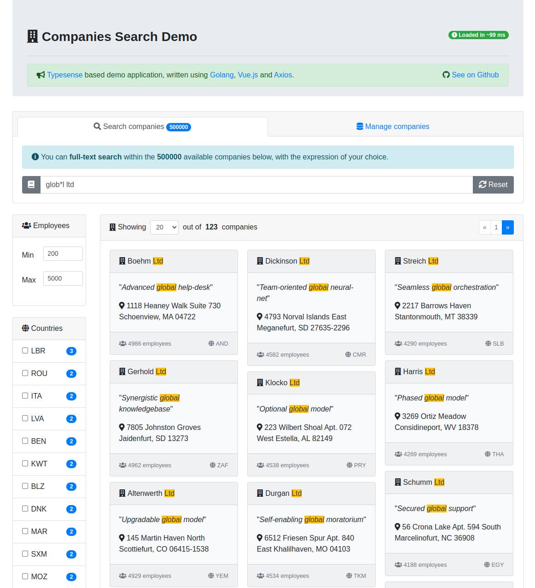

 # Typesense Demo

> [Typesense](https://typesense.org/) companies search demo application, written using [Golang](https://go.dev/), [Vue.js](https://vuejs.org/) and [Axios](https://axios-http.com/).



## About

This project tests [Typesense](https://typesense.org/) features using their [golang library](https://github.com/typesense/typesense-go) and expose them in a reactive web UI:
- live full text search
- results highlighting
- facets
- filtering
- schema management
- bulk imports

## Usage

First, start the provided [docker compose stack](docker-compose.yaml)

```shell
docker compose up -d
```

Then you can access the application on [http://localhost](http://localhost) to:
- first populate the companies collection with the `Wipe and append` button in `Manage companies` section
- and then try to search for them

## Configuration

You can configure the application in the [docker-compose.yaml](docker-compose.yaml) file, on the environment variables section:
- `TYPESENSE_HOST`: Typesense host
- `TYPESENSE_PORT`: Typesense port
- `TYPESENSE_API_KEY`: Typesense API key
